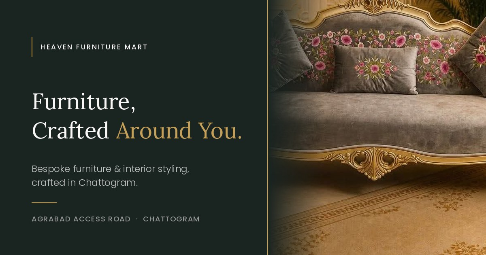
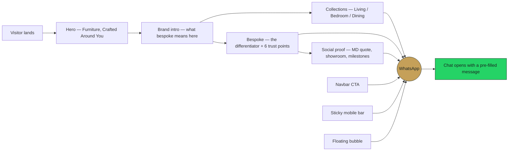
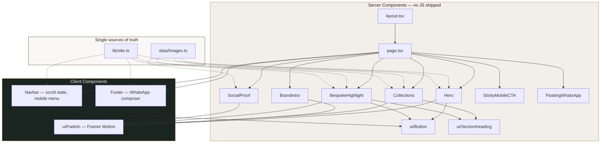
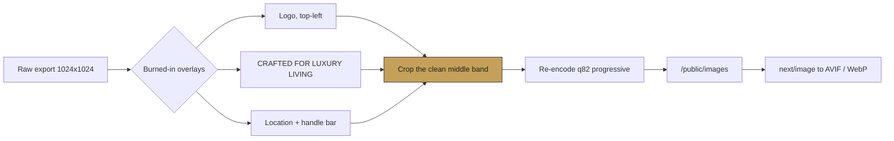

<div align="center">



<br /><br />


<br />

**A conversion-focused luxury landing page for a bespoke furniture brand in Chattogram, Bangladesh.**
Built for the RACDOX Hackathon.

<br />

[](https://heaven-furniture-mart-landing-page.vercel.app/)
[](https://wa.me/8801960481983?text=Hello%20Heaven%20Furniture%20Mart%2C%20I%20want%20a%20free%20design%20consultation.)

<br />


</div>

---

## The brief, in one line

Heaven Furniture Mart designs and builds furniture around a customer's actual
space — not pulled off a shelf. The page has one job: make a stranger understand
that within 30 seconds, then push them toward a single action — a WhatsApp
consultation.

No backend. No CMS. No API. No dark-mode toggle. No second page.

---

## Conversion flow

Every path on the page collapses into one action.



Each entry point sends a **different** pre-filled message, so the shop knows
where the lead came from before they reply. All of them live in one place —
`whatsappMessages` in `app/lib/site.ts`.

---

## Architecture

Server Components by default. Only three components ship JavaScript.



---

## Image pipeline

The client's photos arrived as social-media exports with branding burned in.
Dropping them straight onto the page would have produced two logos and two
headlines per image — a social post, not a showroom.



Every crop was inspected afterwards; two leaked overlay fragments were caught and
re-cropped. Result: **8 images, ~700 KB** before Next.js re-encodes them.

---

## SEO and metadata

All of it lives in `app/layout.tsx` via the Next.js Metadata API.

| Field | Value |
| --- | --- |
| `title` | Heaven Furniture Mart \| Bespoke Furniture in Chattogram |
| `description` | Custom furniture crafted around you. Bespoke sofas, beds, dining sets & interior styling in Chattogram, Bangladesh. Free design consultation. |
| `keywords` | custom furniture Chattogram · bespoke furniture Bangladesh · luxury furniture Chattogram · custom sofa Bangladesh · interior styling Chattogram |
| `metadataBase` | from `NEXT_PUBLIC_SITE_URL` |
| `openGraph.images` | `/og-image.jpg` — 1200×630 |
| `twitter.card` | `summary_large_image` |
| `viewport.themeColor` | `#1A2421` |
| `alternates.canonical` | `/` |

### LocalBusiness structured data

```json
{
  "@context": "https://schema.org",
  "@type": "FurnitureStore",
  "@id": "https://heavenfurnituremart.com/#business",
  "name": "Heaven Furniture Mart",
  "image": "https://heavenfurnituremart.com/images/showroom-interior.jpg",
  "address": {
    "@type": "PostalAddress",
    "streetAddress": "Agrabad Access Road",
    "addressLocality": "Chattogram",
    "addressCountry": "BD"
  },
  "telephone": "+8801960481983",
  "email": "heavenfurnituremart@gmail.com",
  "founder": { "@type": "Person", "name": "Abul Kalam Bhuiyan" },
  "foundingDate": "2020",
  "areaServed": "Chattogram, Bangladesh",
  "sameAs": [
    "https://facebook.com/HeavenFurnitureMart",
    "https://instagram.com/heaven_furniture_ltd",
    "https://youtube.com/@HeavenFurnitureMart"
  ]
}
```

Three deliberate corrections against the supplied brief:

| Brief said | Shipped | Why |
| --- | --- | --- |
| `"telephone": "+8801960-481983"` | `+8801960481983` | E.164 does not allow a hyphen |
| `"sameAs": ["facebook.com/..."]` | `https://facebook.com/...` | schema.org requires absolute URLs |
| `"image": "showroom-image-url"` | absolute URL from env | crawlers cannot resolve a relative path |

---

## Design system

| Token | Hex | Use |
| --- | --- | --- |
| `charcoal` `-light` `-dark` | `#1A2421` `#23302C` `#141D1A` | dark sections, borders, overlays |
| `ivory` `-light` `-dark` | `#F9F8F6` `#FDFCFB` `#F2EFEA` | light backgrounds, cards, dividers |
| `brass` `-light` `-dark` | `#C5A059` `#D4B87A` `#A8873F` | CTA, accents, hairlines |
| `coffee` `-light` `-dark` | `#3E2723` `#5D4037` `#2C1B19` | body, muted, headings on light |

**Type** — Playfair Display (400/700) for headlines and quotes, Inter (300–600)
for everything else, both self-hosted through `next/font`.

**Motion** — one curve everywhere: `cubic-bezier(0.22, 1, 0.36, 1)` at 0.8s,
exposed as `ease-luxe`. No bounce, no fast transitions.

**Signature** — a short brass hairline above every section title, echoing the
inlay lines on the furniture. It reappears as an offset frame behind the hero
and bespoke photos.

### Contrast — measured with the WCAG 2.1 formula, not eyeballed

| Pair | Ratio | AA normal text |
| --- | --- | --- |
| ivory on charcoal | 15.01:1 | pass |
| coffee on ivory | 13.02:1 | pass |
| coffee-light on ivory | 8.78:1 | pass |
| brass on charcoal | 6.48:1 | pass |
| charcoal on brass (CTA) | 6.48:1 | pass |
| **brass on ivory** | **2.32:1** | **fail** |
| **brass-dark on ivory** | **3.19:1** | **fail** — large text only |

Two decisions follow from those last two rows:

1. Brass is **never** text on ivory. Light-section eyebrows use `coffee-light`.
   Brass on ivory appears only as decorative hairlines carrying no information.
2. The focus ring is a **variable**, not a fixed brass ring. `--focus-ring` is
   charcoal on light surfaces and brass inside `.on-dark`. A brass ring on ivory
   would be 2.32:1 — under the 3:1 floor WCAG 1.4.11 sets for focus indicators.
   The brief asked for `focus-visible:ring-brass` *and* AA compliance; those two
   requirements contradict each other, and accessibility won.

---

## Accessibility

- Semantic `header` / `main` / `section` / `footer`, one `h1`, no skipped levels
- Skip-to-content link, visible on keyboard focus
- `aria-label` on every icon-only control
- Mobile menu: `aria-expanded`, `aria-controls`, body-scroll lock, `Escape` closes
- Touch targets at or above 44px; mobile CTA bar 50px with `env(safe-area-inset-bottom)`
- `prefers-reduced-motion` honoured twice — Framer Motion's `useReducedMotion()`
  returns children unanimated, and a CSS media query kills the rest

---

## Getting started

```bash
git clone https://github.com/zahid397/heaven-furniture-mart.git
cd heaven-furniture-mart
npm install
npm run dev            # http://localhost:3000
```

Before deploying:

```bash
npm run typecheck      # tsc --noEmit
npm run lint           # next lint
npm run build          # next build
```

> The first `build` needs internet — `next/font/google` downloads and self-hosts
> Playfair Display and Inter at build time.

### Environment variables

Both are optional; the code falls back to the defaults below.

| Variable | Default | Used for |
| --- | --- | --- |
| `NEXT_PUBLIC_WHATSAPP_NUMBER` | `+8801960481983` | every CTA — non-digits are stripped before the `wa.me` link is built |
| `NEXT_PUBLIC_SITE_URL` | `https://heavenfurnituremart.com` | `metadataBase`, absolute OG images, JSON-LD `@id` — no trailing slash |

Next.js inlines `NEXT_PUBLIC_*` at **build** time. Change one in Vercel and you
must redeploy for it to take effect.

---

## Project structure

```text
app/
├── layout.tsx                 fonts · SEO metadata · FurnitureStore JSON-LD
├── page.tsx                   assembles every section
├── globals.css                Tailwind layers · focus system · reduced motion
├── data/images.ts             every image path + its alt text
├── lib/site.ts                contact details · wa.me builder · nav links
└── components/
    ├── Navbar.tsx             transparent → solid at 50px, full-screen menu
    ├── Hero.tsx               headline · CTA · offset brass-framed photo
    ├── BrandIntro.tsx         positioning statement
    ├── Collections.tsx        Living / Bedroom / Dining, asymmetric grid
    ├── BespokeHighlight.tsx   differentiator + six trust points
    ├── SocialProof.tsx        MD quote · showroom · milestone strip
    ├── Footer.tsx             contact · socials · WhatsApp composer
    ├── FloatingWhatsApp.tsx   fixed bubble
    ├── StickyMobileCTA.tsx    full-width bar, mobile only
    └── ui/
        ├── Button.tsx         primary · outline · quiet
        ├── FadeIn.tsx         FadeIn · Stagger · StaggerItem
        └── SectionHeading.tsx eyebrow · brass rule · title · subtitle
```

`@/*` resolves to `./app/*`, so `@/data/images` and `@/components/Hero` both work.

### Swapping the photography

1. Drop the new file into `/public/images/` with the **same filename**.
2. Different filename? Update `app/data/images.ts` — nothing else.
3. Update the matching `imageAlt` entry in the same file.

---

## Verification status

Read this before claiming anything about the build.

**Verified**

- 17/17 `.ts` / `.tsx` files parse cleanly — TypeScript 6.0.3 parser, 0 syntax diagnostics
- Every `@/` import resolves to a real file (33/33)
- Server/client boundaries correct — only Navbar, Footer and FadeIn carry `'use client'`
- Contrast ratios computed with the WCAG relative-luminance formula, not estimated
- Every image crop visually inspected — no leftover logo, headline or location-bar pixels
- Two layout bugs caught from static mockups and fixed: the hero headline
  overflowing the image card at `xl` (6/6 grid → 7/5, headline capped at 64px),
  and the offset brass frame anchored to a padded parent instead of the photo

**Not verified**

- Lighthouse / Core Web Vitals are unmeasured. The performance budget in the
  brief is a target here, not a result.
- The mobile hero fold fix (tighter spacing, `3/4` phone aspect) has not been
  checked on a real device.
- No automated tests exist in this repo, and none were run.

---

## Contact — Heaven Furniture Mart

Agrabad Access Road (opposite RAK Ceramics), Chattogram, Bangladesh
[+880 1960-481983](tel:+8801960481983) · [heavenfurnituremart@gmail.com](mailto:heavenfurnituremart@gmail.com)
[Facebook](https://facebook.com/HeavenFurnitureMart) · [Instagram](https://instagram.com/heaven_furniture_ltd) · [YouTube](https://youtube.com/@HeavenFurnitureMart)

---

## Built by

```text
        .-"""""""-.
      .'           '.
     /   .-------.   \
    ;   /  _   _  \   ;
    |  |  (o) (o)  |  |     zahid397@workspace
    ;   \    ^    /   ;     -------------------
     \   '.  -  .'   /      Role: Full-Stack & Android Engineer
      '.   '---'   .'       Education: BBA, Presidency University, Dhaka
        '-._____.-'         Languages: JavaScript, TypeScript, Kotlin, Python
      ___|       |___       Tech Stack: Next.js, React, FastAPI, WordPress
     /               \      Philosophy: "দিনে চাকরি করি। রাতে স্বপ্ন বানাই।"
    |  .-----------.  |     Focus: AI/ML Integration, Architecture, Hackathons
    |  | > whoami   |  |    GitHub Stats: Repos: 50+ | Commits: 1000+
    |  | > zahid_   |  |
    |  '-----------'  |
     \_______________/
    '-----------------'
```

<div align="center">

[](https://github.com/zahid397)
[](https://heaven-furniture-mart-landing-page.vercel.app/)

<sub>RACDOX Hackathon · Designed with ❤️ in Chattogram</sub>

</div>
